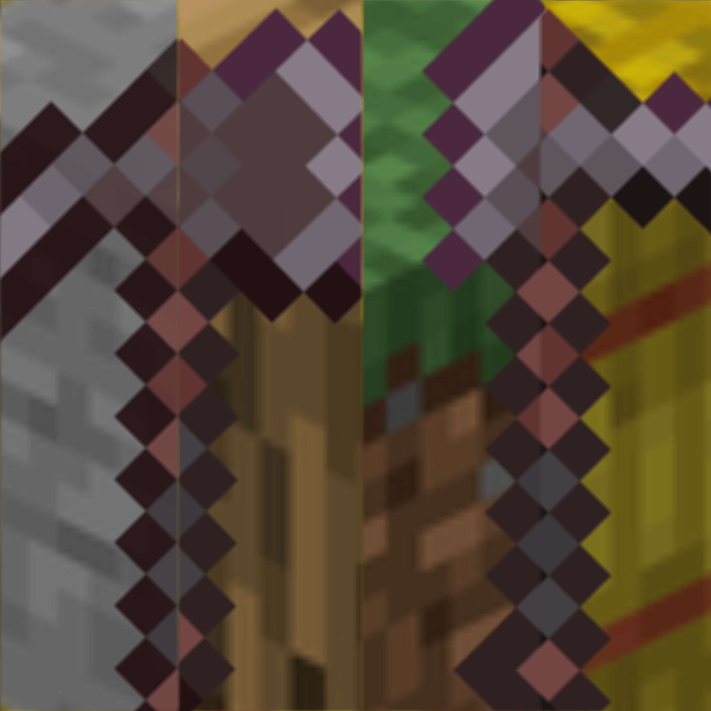

# QuickToolSelect

---

<div align="center">

</div>

This simple client-side mod makes it so when you hold the middle mouse button (usually the scroll wheel), it automatically equips the best tool for the job!

If you tend to make a total mess of your inventory while building or out exploring like me, this mod will make your life a whole lot easier.

--- 

## Configuration

Not much to configure, but for those who don't like the time to hold you can change it via ModMenu.

If you don't have ModMenu installed you can run ```/quicktool``` and that will open the config window.

## Versions

-   Default version: Uses YACL and ModMenu (optional) to be able to configure hold time.

-   `barebones-noConfig`: is lighter and doesn't require any dependencies, but has a default hardcoded hold time of 10 ticks.

## License

This project is available under the **GNU GPLv3** license. Feel free to learn from it and incorporate it into your own projects under its conditions!

For more details, check out the [LICENSE](LICENSE)